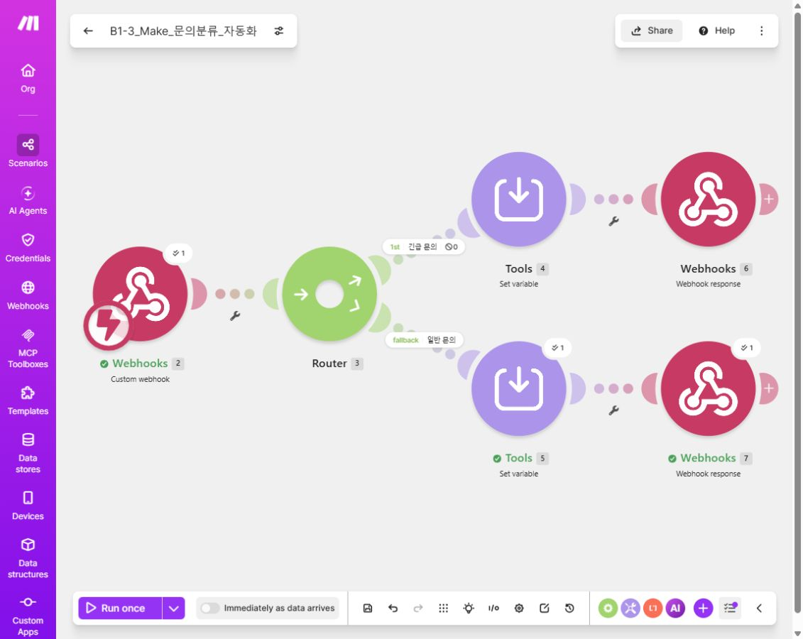
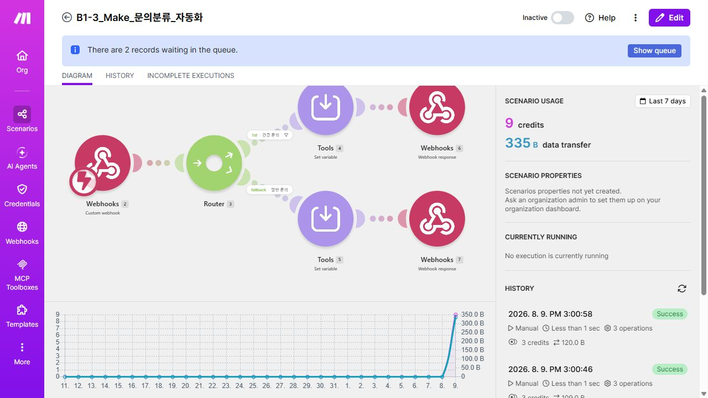
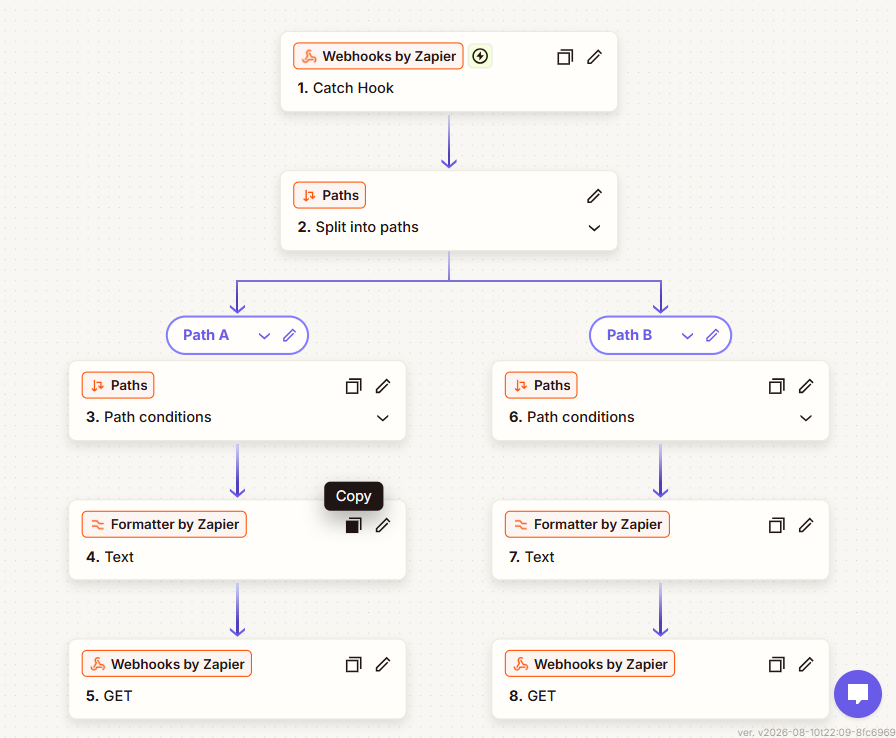
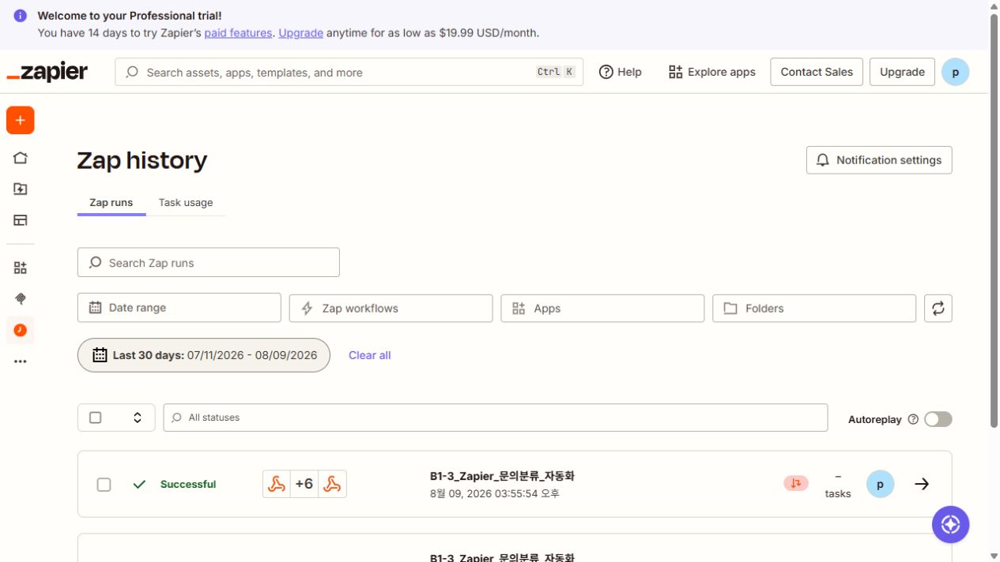
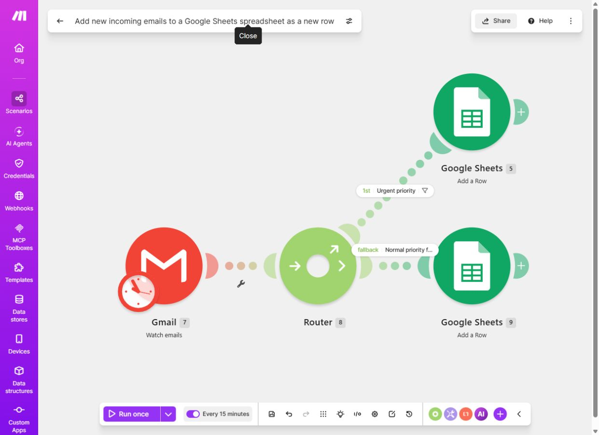
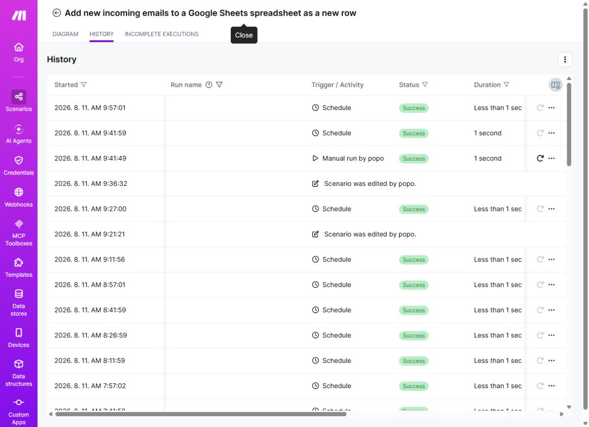
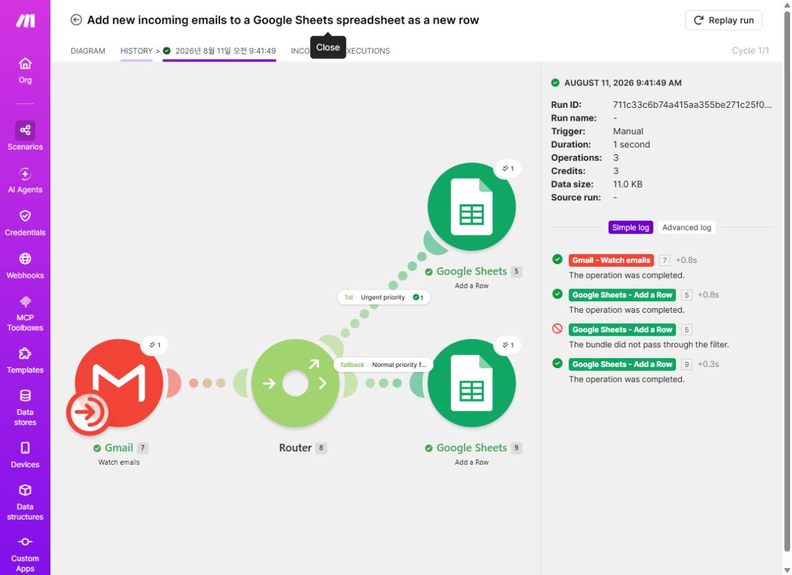
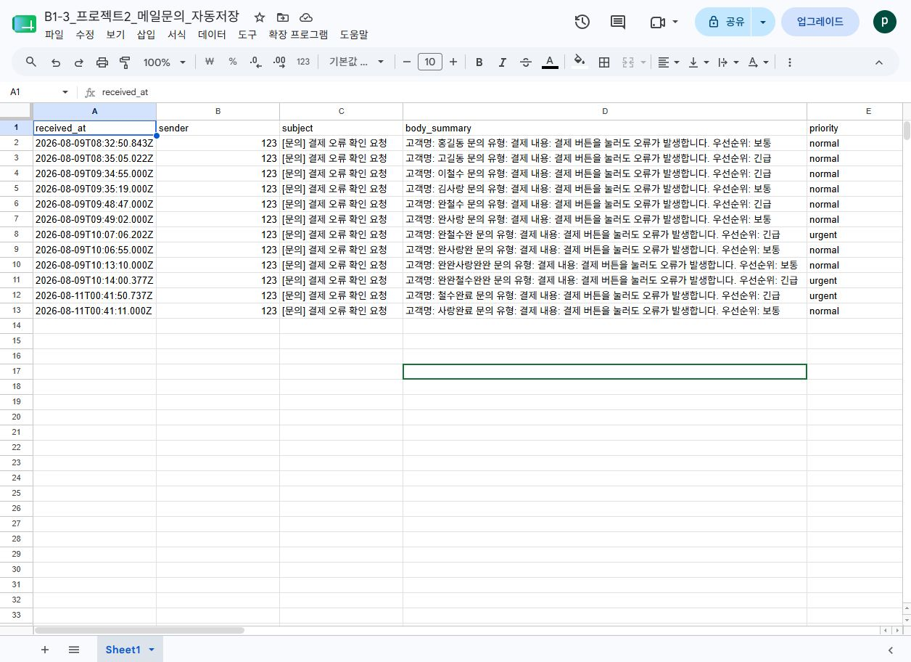
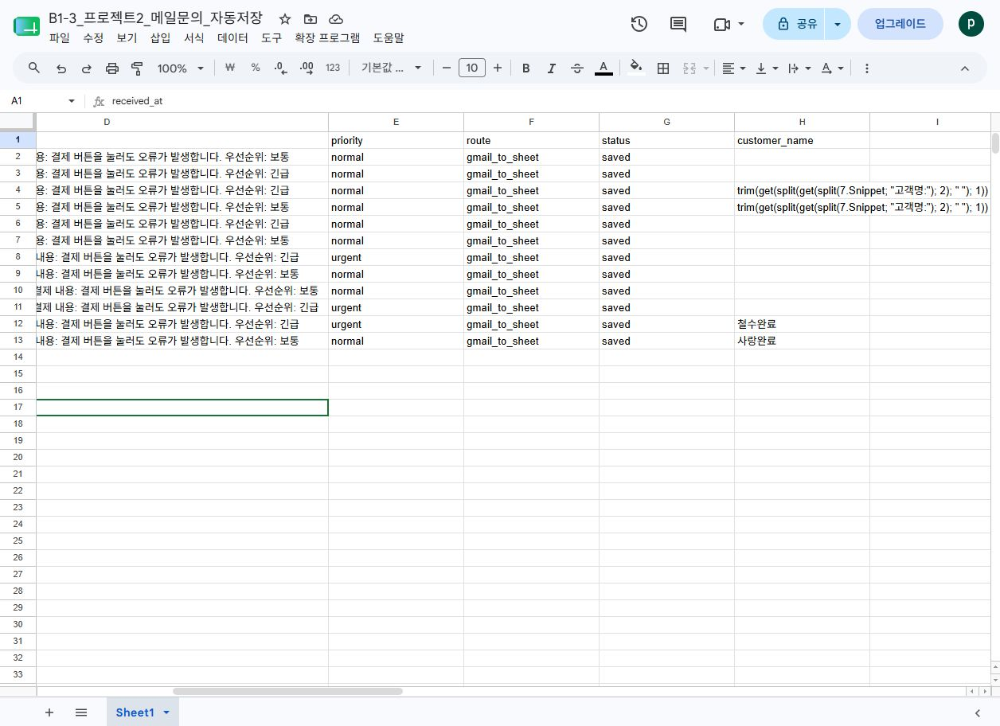
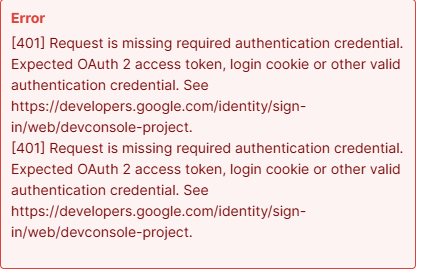

# B1-3 노코드 자동화 기초 워크플로우 설계 최종 보고서

* 작성일: 2026-08-11

* 제출 형식: Markdown

* 사용 도구: Make, Zapier, Gmail, Google Sheets

* 선택 보너스: 보너스 2 — 실패 상황 확인 및 재시도 전략

> 제출 화면에는 API Key, 토큰, 비밀번호, Webhook URL을 포함하지 않았다. 계정 이메일도 보고서 본문과 캡처에서 노출하지 않았다.

​

## 1. 핵심 개념

### Trigger와 Action의 차이

Trigger는 자동화를 시작시키는 사건이고, Action은 Trigger가 발생한 뒤 데이터를 처리하는 단계이다.

예를 들어 프로젝트 2에서 새 문의 메일이 감지되는 것은 Trigger이다. 이 단계는 메일의 날짜, 발신자, 제목, 본문 요약을 다음 단계로 전달한다. 전달받은 메일을 긴급·일반으로 구분하고 Google Sheets에 행을 추가하는 것은 Action이다.

### Filter와 Router의 역할

Filter와 Router는 입력 데이터가 정해진 조건을 만족하는지 확인하고 처리 경로를 나눈다. 단순히 분기 모양만 만드는 것이 아니라, 각 조건에 해당하는 테스트 데이터를 넣어 모든 경로가 실제로 실행되는지 확인해야 한다.

​

# 프로젝트 1. Make와 Zapier의 동일 자동화 비교 구현

## 2. 자동화 주제

고객 문의가 Webhook으로 들어오면 `priority` 값에 따라 긴급 문의와 일반 문의로 분류하고, 각 경로에서 처리 상태를 만든 뒤 Webhook/HTTP 방식으로 결과를 전달하는 워크플로우를 Make와 Zapier에 각각 구현했다.

테스트 입력은 다음 두 종류를 사용했다.

```text
name=Kim
inquiry=payment_issue
priority=urgent
```

```text
name=Park
inquiry=general_question
priority=normal
```

## 3. 두 도구의 동일성을 맞춘 설계 기준

| 설계 기준     | Make                      | Zapier                             |
| --------- | ------------------------- | ---------------------------------- |
| 입력 이벤트    | Webhooks — Custom webhook | Webhooks by Zapier — Catch Hook    |
| 핵심 입력값    | 문의자, 문의 유형, 우선순위          | 문의자, 문의 유형, 우선순위                   |
| 분기 기준     | `priority=urgent` / 그 외 값 | `priority=urgent` / `urgent`가 아닌 값 |
| 처리 Action | 상태 변수 생성                  | 텍스트 포맷팅                            |
| 최종 출력     | Webhook response          | Webhooks GET 요청                    |

도구마다 모듈 이름과 출력 방식은 다르지만, **Webhook 수신 → 우선순위 분기 → 상태 가공 → 결과 전달**이라는 핵심 업무 흐름을 동일하게 맞췄다.

## 4. Make 구현

시나리오 이름: `B1-3_Make_문의분류_자동화`

| 구분       | 내용                                 |
| -------- | ---------------------------------- |
| Trigger  | Webhooks — Custom webhook          |
| Router   | 긴급 문의 / 일반 문의 경로 분리                |
| 긴급 조건    | `priority`가 `urgent`와 일치           |
| 일반 조건    | 긴급 조건에 해당하지 않는 fallback 경로         |
| Action 1 | Tools — Set variable로 처리 상태 생성     |
| Action 2 | Webhooks — Webhook response로 결과 반환 |

### 구성 화면



*Webhook Trigger, Router, 두 분기와 각 분기의 Action을 한 화면에서 확인할 수 있다.​*

### 실행 결과



*History에 성공 실행이 기록되어 있으며 긴급·일반 테스트 입력을 각각 실행했다.​*

## 5. Zapier 구현

Zap 이름: `B1-3_Zapier_문의분류_자동화`

| 구분       | 내용                                        |
| -------- | ----------------------------------------- |
| Trigger  | Webhooks by Zapier — Catch Hook           |
| Branch   | Paths by Zapier                           |
| Path A   | `Querystring Priority`가 `urgent`와 정확히 일치  |
| Path B   | `Querystring Priority`가 `urgent`와 일치하지 않음 |
| Action 1 | Formatter by Zapier — Text                |
| Action 2 | Webhooks by Zapier — GET                  |

### 구성 및 발행 화면



*두 개의 Path와 각 경로의 Formatter, Webhooks Action이 포함된 Zap을 발행했다.​*

### 실행 결과



*Zap history에서 Successful 상태의 실행 기록을 확인했다.​*

## 6. Make와 Zapier 비교 분석

| 비교 기준    | Make                                                  | Zapier                                          |
| -------- | ----------------------------------------------------- | ----------------------------------------------- |
| UI/UX    | 노드와 연결선으로 전체 구조와 분기를 한눈에 볼 수 있다.                      | 단계가 위에서 아래로 배치되어 처음 사용하는 사람도 순서를 따라가기 쉽다.       |
| 설정 난이도   | Router, Filter, 번들 개념을 익혀야 하지만 복잡한 흐름을 세밀하게 설정할 수 있다. | 앱과 필드 선택 안내가 친절하지만 Path와 멀티스텝 설정 화면을 여러 번 이동한다. |
| 분기 처리    | Router와 Filter를 조합해 분기 수를 유연하게 확장하기 좋다.               | Paths로 분기를 만들기 쉽지만 플랜 기능 범위의 영향을 받을 수 있다.       |
| 디버깅      | 모듈별 입력·출력 번들과 통과하지 못한 Filter를 자세히 확인할 수 있다.           | 단계별 Test와 Zap history를 통해 오류가 발생한 단계를 확인할 수 있다. |
| 실행 로그    | 실행 한 건의 경로와 데이터 변화를 시각적으로 추적하기 좋다.                    | 실행 목록이 간결하고 상태 확인이 빠르다.                         |
| 확장성      | 여러 Router, 데이터 가공, 예외 경로가 필요한 복잡한 업무에 유리하다.           | Gmail, Sheets 등 일반 업무 앱을 빠르게 연결하는 자동화에 유리하다.    |
| 무료·체험 범위 | 비교적 복잡한 시나리오도 구성할 수 있으나 실행량 한도를 관리해야 한다.              | Paths와 멀티스텝 기능은 무료 또는 체험 플랜 제한을 확인해야 한다.        |
| 운영 적합성   | 복잡한 분기, 세부 로그, 데이터 변환이 중요한 운영 업무에 적합하다.               | 단순한 앱 연결을 빠르게 배포하고 관리하는 업무에 적합하다.               |

### 장단점과 적합한 상황

Make는 Router가 시각적으로 드러나고 모듈별 데이터를 자세히 확인할 수 있어 조건이 많고 오류 분석이 중요한 자동화에 적합하다. 반면 처음에는 모듈과 번들 개념이 낯설 수 있다.

Zapier는 단계별 설정 안내와 발행 과정이 직관적이므로 단순한 업무 앱 연동을 빠르게 만들 때 적합하다. 반면 여러 Path와 멀티스텝 기능은 플랜 제한과 설정 화면 이동을 고려해야 한다.

​

# 프로젝트 2. Gmail 문의 메일 자동 분류 및 Google Sheets 저장

## 7. 반복 업무 정의

담당자가 고객 문의 메일을 매번 열어 제목과 본문을 확인하고, 우선순위를 판단한 뒤 고객명·문의 내용·처리 상태를 Google Sheets에 직접 입력하는 반복 업무를 자동화했다.

자동화 대상 메일의 형식은 다음과 같다.

```text
제목: [문의] 결제 오류 확인 요청

고객명: 홍길동
문의 유형: 결제
내용: 결제 버튼을 눌러도 오류가 발생합니다.
우선순위: 긴급
```

## 8. 도구 선정 및 선정 이유

선정 도구는 **Make**이다.

1. **분기와 디버깅:​** Router의 경로가 화면에 직접 표시되고, 실행 기록에서 어떤 Filter를 통과했는지 확인하기 쉽다.

2. **연동과 확장성:​** Gmail과 Google Sheets를 같은 시나리오에서 연결하고, 이후 오류 처리 또는 알림 경로를 추가하기 쉽다.

3. **비용:​** 이번 과제의 테스트 실행량은 무료 사용 범위에서 관리할 수 있다.

## 9. 워크플로우 설계

```text
Gmail — Watch emails
  (제목 검색: subject:[문의], 15분 간격)
        ↓
Router
  ├─ 긴급 경로: Snippet에 "긴급" 또는 "급함" 포함
  │      ↓
  │   Google Sheets — Add a Row
  │   priority=urgent
  │
  └─ 일반 fallback 경로
         ↓
      Google Sheets — Add a Row
      priority=normal
```

### 단계별 입력과 출력

| 단계 | 구분       | 입력            | 처리                        | 출력                      |
| -- | -------- | ------------- | ------------------------- | ----------------------- |
| 1  | Trigger  | Gmail의 새 메일   | 제목이 `[문의]`인 메일을 최대 10개 확인 | 날짜, 발신자, 제목, Snippet    |
| 2  | Router   | Gmail Snippet | `긴급` 또는 `급함` 포함 여부 검사     | 긴급 경로 또는 일반 fallback 경로 |
| 3  | Action 1 | 긴급 문의 데이터     | 우선순위를 `urgent`로 지정하고 행 추가 | 긴급 문의가 저장된 시트 행         |
| 4  | Action 2 | 일반 문의 데이터     | 우선순위를 `normal`로 지정하고 행 추가 | 일반 문의가 저장된 시트 행         |
| 5  | 최종 출력    | 메일·분기 결과      | 고객명과 문의 정보를 열별로 기록        | 조회 가능한 문의 처리 목록         |

### Google Sheets 저장 열

| 열              | 저장 내용                  |
| -------------- | ---------------------- |
| received\_at   | 메일 수신 일시               |
| sender         | 발신자 표시 이름              |
| subject        | 메일 제목                  |
| body\_summary  | Gmail Snippet          |
| priority       | `urgent` 또는 `normal`   |
| route          | `gmail_to_sheet`       |
| status         | `saved`                |
| customer\_name | `고객명:`과 `문의 유형:` 사이의 값 |

## 10. 구현 화면



*Gmail Trigger, Router, 긴급·일반 분기와 두 Google Sheets Action을 확인할 수 있다.​*

## 11. 실행 및 분기 검증

### 자동 실행 이력



*시나리오는 Active 상태이며 15분 간격 Schedule 실행이 Success로 기록되었다.​*

### 두 분기의 실제 실행



*한 번의 실행에서 긴급 문의와 일반 문의가 각각 해당 Google Sheets 모듈을 통과했다. Simple log에서 두 Add a Row 작업의 완료 상태를 확인할 수 있다.​*

### 테스트 결과

| 테스트 입력            | 기대 경로          | 실행 결과                       |
| ----------------- | -------------- | --------------------------- |
| 본문에 `우선순위: 긴급` 포함 | 긴급 경로          | Google Sheets에 `urgent`로 저장 |
| 본문에 `우선순위: 보통` 포함 | 일반 fallback 경로 | Google Sheets에 `normal`로 저장 |

## 12. Google Sheets 최종 결과

​


​

​



*메일의 수신 시각, 발신자, 제목, 본문 요약과 우선순위가 새 행으로 누적된다.​*



*긴급 문의는**`urgent`**, 일반 문의는**`normal`**로 저장되었고, 수정 후 테스트 행에는 고객명도 정상적으로 표시되었다.​*

​

# 보너스 2. 실패 상황 확인 및 재시도 전략

## 13. 발생한 문제와 해결

### 문제 1 — Google 인증 오류

Google 모듈 실행 중 OAuth 인증 정보가 전달되지 않아 `401 Request is missing required authentication credential` 오류가 발생했다.



**해결:​** Make의 Gmail·Google Sheets 연결을 다시 선택하고 Google 계정 권한을 재승인했다. 연결 복구 후 동일 시나리오를 다시 실행하여 History의 Success 상태를 확인했다.

### 문제 2 — 고객명과 우선순위 매핑 오류

초기에는 고객명 추출 식이 계산되지 않고 문자열 그대로 저장되거나 빈칸으로 남았으며, 긴급 메일도 `normal`로 기록되는 문제가 있었다.

**해결:​**

* 긴급 Router 조건을 Gmail `Snippet`에 `긴급` 또는 `급함`이 포함된 경우로 수정했다.

* 긴급 경로에는 `priority=urgent`, 일반 fallback 경로에는 `priority=normal`을 각각 고정했다.

* 고객명 식 안에 일반 문장이 아니라 실제 Make의 `7. Snippet` 변수 토큰을 삽입했다.

* `고객명:`과 `문의 유형:` 사이를 추출하도록 다음 형태로 매핑했다.

```text
=IFERROR(REGEXEXTRACT("{{7.Snippet}}","고객명: (.*?) 문의 유형:"),"")
```

수정 후 긴급·일반 테스트 메일을 다시 처리했고, 실행 로그와 시트에서 각각 `urgent/normal` 및 고객명 결과를 확인했다. 위의 프로젝트 2 분기 실행 화면과 Google Sheets 결과 화면이 수정 후 결과이다.

## 14. 재시도 및 대체 경로 전략

이번 과제에서는 오류 원인을 수정한 뒤 Make의 수동 실행과 실행 이력으로 재검증했다. 실제 운영에서는 다음 구조로 확장할 수 있다.

```text
Google Sheets 저장 실패
  → Error handler
  → 임시 오류 시트에 시간·모듈·오류 요약 기록
  → 담당자에게 이메일 알림
  → 연결 복구 후 History에서 Replay run
```

이 방식은 원본 문의가 사라지는 것을 막고, 수정 후 같은 실행을 다시 처리할 수 있게 한다.

​

# 평가기준 대응 핵심 설명

## 15. 트리거 또는 외부 연동이 불안정한 경우

Make History의 실패 상태와 Incomplete executions를 주기적으로 확인한다. 실패한 모듈명, 실행 시각, 오류 메시지를 오류 시트에 남기고 담당자에게 알림을 보낸다. 일시적인 API 오류는 제한된 횟수만 재시도하고, 인증 오류처럼 설정 수정이 필요한 경우에는 연결을 복구한 뒤 Replay run을 사용한다.

## 16. 분기 규칙이 늘어나는 경우

한 Router에 모든 조건을 넣지 않고 1차로 우선순위, 2차로 문의 유형처럼 기준별 Router를 나눈다. 공통 Google Sheets 저장 필드는 한 가지 형식으로 유지하고, 경로 이름과 Filter 이름을 명확하게 작성한다. 여러 경로에서 반복되는 데이터 변환은 별도의 공통 모듈 또는 재사용 가능한 함수로 분리한다.

## 17. 노코드 자동화의 한계와 코드 기반 확장

메일 작성 형식이 사람마다 크게 달라지면 단순한 `고객명:` 문자열 기준으로는 값을 안정적으로 추출하기 어렵다. 이런 업무는 Gmail API와 Python 또는 JavaScript 파서를 사용해 여러 형식을 처리하고, 정규식 단위 테스트와 상세 로그를 추가하는 코드 기반 자동화로 확장할 수 있다. Make는 Trigger와 최종 연동을 담당하고, 복잡한 파싱만 코드 서비스에 맡기는 혼합 구조도 가능하다.

​

# 최종 제출 체크리스트

| 평가 기준                 | 충족 여부 | 보고서 근거                                     |
| --------------------- | ----- | ------------------------------------------ |
| 프로젝트 1에서 2개 이상의 도구 사용 | 충족    | Make와 Zapier 구현                            |
| 프로젝트 1의 동일 워크플로우 구현   | 충족    | Webhook → 분기 → 가공 → 결과 전달                  |
| 프로젝트 1 구성·실행 캡처       | 충족    | 4장 첨부                                      |
| 비교 항목 5개 이상           | 충족    | 8개 항목 비교                                   |
| 도구별 장단점과 적합한 상황       | 충족    | 비교 분석 하단 설명                                |
| 프로젝트 2 Trigger 1개 이상  | 충족    | Gmail — Watch emails                       |
| 프로젝트 2 Action 2개 이상   | 충족    | 긴급·일반 Google Sheets — Add a Row            |
| 프로젝트 2 조건 분기 1개 이상    | 충족    | Router의 긴급 조건과 일반 fallback                 |
| 프로젝트 2 자동 실행          | 충족    | Active, Every 15 minutes, Schedule Success |
| 모든 분기 경로 실행           | 충족    | 긴급·일반 Add a Row 완료 화면                      |
| 단계별 입력·출력 설명          | 충족    | 단계별 설계 표                                   |
| 구현·실행·결과 캡처           | 충족    | Make 구성, History, 실행 상세, Sheets 결과         |
| 특정 도구 선정 이유 2개 이상     | 충족    | 분기·디버깅, 연동·확장성, 비용                         |
| 보너스 2 문제 해결           | 충족    | 인증 오류와 매핑 오류 해결 및 재시도 전략                   |
| 민감정보 비노출              | 충족    | 토큰·키·비밀번호·Webhook URL 미기재                  |

## 결론

프로젝트 1에서는 동일한 문의 분류 업무를 Make와 Zapier로 구현해 도구별 설정 방식과 운영 차이를 비교했다. 프로젝트 2에서는 Gmail 문의를 자동으로 감지하고 긴급·일반으로 분류해 Google Sheets에 저장하는 자동화를 구현했다. 실제 테스트에서 두 분기가 모두 실행되었으며, 인증과 데이터 매핑 오류를 수정하고 재시도하는 과정까지 확인했다.
